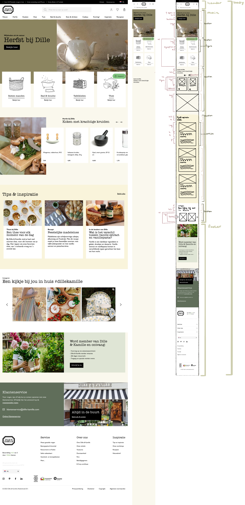
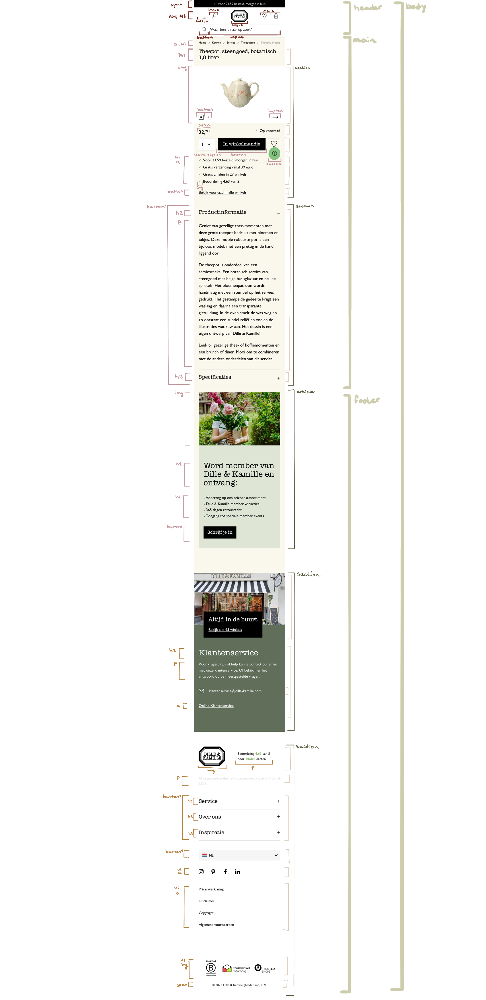

# Procesverslag
Markdown is een simpele manier om HTML te schrijven.  
Markdown cheat cheet: [Hulp bij het schrijven van Markdown](https://github.com/adam-p/markdown-here/wiki/Markdown-Cheatsheet).

Nb. De standaardstructuur en de spartaanse opmaak van de README.md zijn helemaal prima. Het gaat om de inhoud van je procesverslag. Besteedt de tijd voor pracht en praal aan je website.

Nb. Door *open* toe te voegen aan een *details* element kun je deze standaard open zetten. Fijn om dat steeds voor de relevante stuk(ken) te doen.

## Jij

  
uitwerken voor kick-off werkgroep

  ### Auteur:
  Quirine Zonneveld

  #### Je startniveau:
  blauw

  #### Je focus:
  surface plane (kies uit responsive óf surface plane)
 

## Je website

  
uitwerken voor kick-off werkgroep

  ### Je opdracht:
  Dille & Kamille: https://www.dille-kamille.nl/

  #### Screenshot(s) van de eerste pagina (small screen): 
  Dille & Kamille  
  

  #### Screenshot(s) van de tweede pagina (small screen):
  Dille & Kamille  
  
  

## Toegankelijkheidstest 1/2 (week 1)

  
uitwerken na test in 2e werkgroep

  ### Bevindingen
  Lijst met je bevindingen die in de test naar voren kwamen:

## Breakdownschets (week 1)

  
uitwerken na afloop 3e werkgroep

  ### de hele pagina: 
  
  

  ### dynamisch deel (bijv menu): 
  

  <!-- ### wellicht nog een dynamisch deel (bijv filter): 
   -->

## Voortgang 1 (week 2)

  
uitwerken voor 1e voortgang

  ### Stand van zaken
  hier dit ging goed & dit was lastig (neem ook screenshots op van delen van je website en code)

  vragen:
  1. bij sommige delen twijl ik of het een section / div / div in bovenste section / article is?
  2. hoe schrijf ik een ' in een p?
  3. geef ik de goede h aan de elementen?
  4. dropdown
  5. Bij de arrow button, heb ik een img in de button gedaan. Het laat de img echter niet zien, hoe kan dit?
  6. Detailpagina: zijn het twee losse ul?
  7. Wanneer gebruik ik grid en wanneer flexbox?

  ### Agenda voor meeting
  samen met je groepje opstellen

  | student 1      | student 2          | student 3    | student 4        |
  | ---            | ---                | ---          | ---              |
  | dit bespreken  | en dit             | en ik dit    | en dan ik dat    |
  | en dat ook nog | dit als er tijd is | nog een punt | dit wil ik zeker |
  | ...            | ...                | ...          | ...              |

  ### Verslag van meeting
  hier na afloop snel de uitkomsten van de meeting vastleggen

  - punt 1
  - punt 2
  - nog een punt
  - ...

## Voortgang 2 (week 3)

  
uitwerken voor 2e voortgang

  ### Stand van zaken
  hier dit ging goed & dit was lastig (neem ook screenshots op van delen van je website en code)

  vragen:
  -Koken met krachtige kruiden: image heb ik geplaatst met top: … , kan dit ook op een andere manier (als ik nu content erboven plaats klopt de plaatsing dan niet meer.
  - Benaming :root
  - Errors in html
  - Section in een section -> homepage h1??
  - wanneer ik 4e section selecteert, selecteert het ook andere elementen, hoe kan dit?

  ### Agenda voor meeting
  samen met je groepje opstellen

  | student 1      | student 2          | student 3    | student 4        |
  | ---            | ---                | ---          | ---              |
  | dit bespreken  | en dit             | en ik dit    | en dan ik dat    |
  | en dat ook nog | dit als er tijd is | nog een punt | dit wil ik zeker |
  | ...            | ...                | ...          | ...              |

  ### Verslag van meeting
  hier na afloop snel de uitkomsten van de meeting vastleggen

  - punt 1
  - punt 2
  - nog een punt
- ...

## Toegankelijkheidstest 2/2 (week 4)

  
uitwerken na test in 9e werkgroep

  ### Bevindingen
  Lijst met je bevindingen die in de test naar voren kwamen (geef ook aan wat er verbeterd is):

## Voortgang 3 (week 4)

  
uitwerken voor 3e voortgang

  ### Stand van zaken
  hier dit ging goed & dit was lastig (neem ook screenshots op van delen van je website en code)

  ### Agenda voor meeting
  samen met je groepje opstellen

  | student 1      | student 2          | student 3    | student 4        |
  | ---            | ---                | ---          | ---              |
  | dit bespreken  | en dit             | en ik dit    | en dan ik dat    |
  | en dat ook nog | dit als er tijd is | nog een punt | dit wil ik zeker |
  | ...            | ...                | ...          | ...              |

  ### Verslag van meeting
  hier na afloop snel de uitkomsten van de meeting vastleggen

  - punt 1
  - punt 2
  - nog een punt
  - ...

## Eindgesprek (week 5)

  
uitwerken voor eindgesprek

  ### Je uitkomst - karakteristiek screenshots:
  

  ### Dit ging goed/Heb ik geleerd: 
  Korte omschrijving met plaatjes

  

  ### Dit was lastig/Is niet gelukt:
  Korte omschrijving met plaatjes

  

## Bronnenlijst

  
continu bijhouden terwijl je werkt

  Nb. Wees specifiek ('css-tricks' als bron is bijv. niet specifiek genoeg). 
  Nb. ChatGpT en andere AI horen er ook bij.
  Nb. Vermeld de bronnen ook in je code.

  1. Position sticky: https://developer.mozilla.org/en-US/docs/Web/CSS/position
  2. Adress: https://developer.mozilla.org/en-US/docs/Web/HTML/Element/address 
  3. Select: https://developer.mozilla.org/en-US/docs/Web/HTML/Element/select 
  4. Transform: translate(): https://developer.mozilla.org/en-US/docs/Web/CSS/transform 
  5. Flip an image: https://css-tricks.com/snippets/css/flip-an-image/ 
  6. List-style-type: https://developer.mozilla.org/en-US/docs/Web/CSS/list-style-type
  7. TextContent: https://developer.mozilla.org/en-US/docs/Web/API/Node/textContent  
  8. Input type="search”: https://developer.mozilla.org/en-US/docs/Web/HTML/Element/input/search 
  9. Image galary: https://www.youtube.com/watch?v=gzXyRa7jwk4 
  10. Box-shadow: https://developer.mozilla.org/en-US/docs/Web/CSS/box-shadow
  11. Fit-content: https://developer.mozilla.org/en-US/docs/Web/CSS/fit-content 
  12. ForEach: https://developer.mozilla.org/en-US/docs/Web/JavaScript/Reference/Global_Objects/Array/forEach 
  13. Closest(): https://www.w3schools.com/jsref/met_element_closest.asp 
  14. GetAttribute(): https://developer.mozilla.org/en-US/docs/Web/API/Element/getAttribute 
  15. SetAttribute(): https://developer.mozilla.org/en-US/docs/Web/API/Element/setAttribute 
  16. input type="radio”: https://developer.mozilla.org/en-US/docs/Web/HTML/Element/input/radio 
  17. Cursor: https://developer.mozilla.org/en-US/docs/Web/CSS/cursor 
  18. Filter: https://developer.mozilla.org/en-US/docs/Web/CSS/filter 
  19. scroll-behavior: https://developer.mozilla.org/en-US/docs/Web/CSS/scroll-behavior
  20. scroll-snap-type: https://www.youtube.com/watch?v=Xc6G3oV24yE
  21. darklight-mode: https://www.w3schools.com/howto/howto_js_toggle_dark_mode.asp
  22. skip to main content: https://www.youtube.com/watch?v=287mLmuamoM https://www.youtube.com/watch?v=jDDaOFr9nqQ 
  23. scroll-animation: https://www.youtube.com/watch?v=huVJW23JHKQ https://youtu.be/huVJW23JHKQ?si=iJcgi2joHmCez_Jo 
  24. loading-state: https://youtu.be/VbAD6cifkWM?si=8Ksq2coWmzMVNXvg https://youtu.be/q76TexbMXJg?si=vlp8dG1rG1nBCQAv

